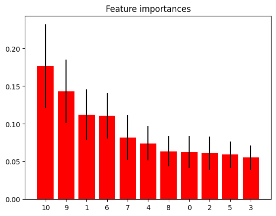
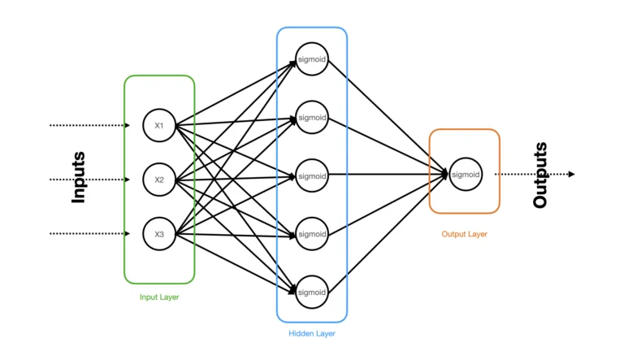
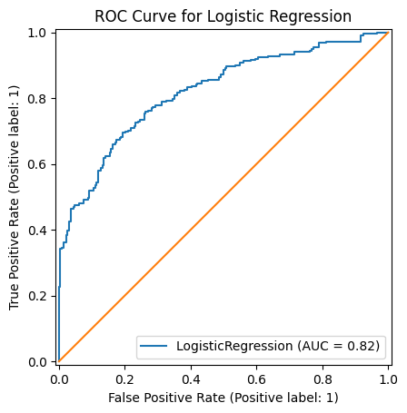
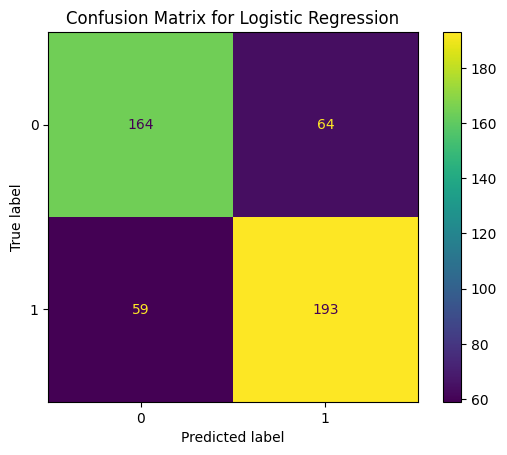
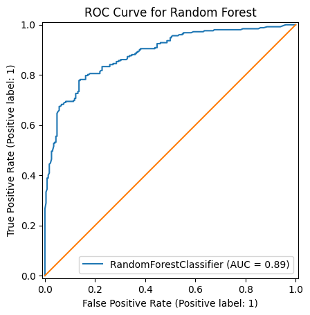
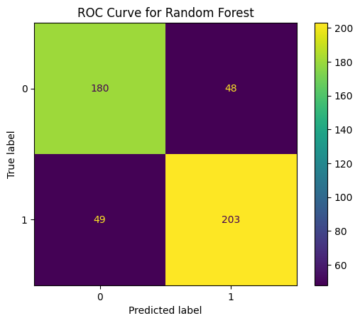
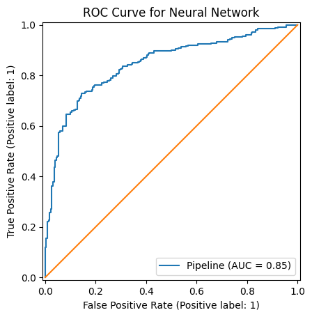
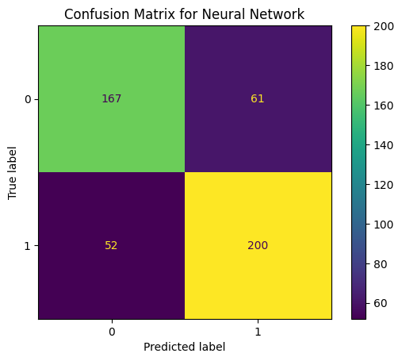
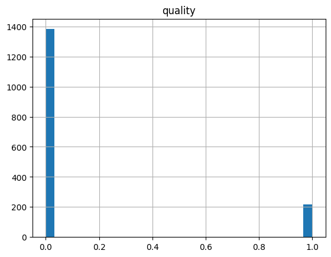

<script id="MathJax-script" async src="https://cdn.jsdelivr.net/npm/mathjax@3/es5/tex-mml-chtml.js"></script>

# Quality of Portuguese "Vinho Verde" Redwine Classification

I applied machine learning techniques to predict the quality of "Vinho Verde" redwine from the UCI Machine Learning Repository (Cortez et al. 2019).
***

# Introduction 

Wine has become a widely enjoyed drink, consumed by many across the world for leisure or for gatherings. With about 870 million gallons of wine being consumed by the US alone in 2024, it is clear that there is a need for automated wine quality predictions rather than subjective wine tastings from human tasters (GFA Wine 2024). According to an article from the Gaurdian, on average only 10% of wine tasters were consistent with their tastings per year (Derbyshire, David 2013). To keep wine tasting objective and consistent, machine learning may be the answer to predicting wine quality.

I used the Wine Quality dataset from the UCI Machine Learning Repository, specifically only the red wine dataset. The intention of this project is to apply supervised classification machine learning models in order to predict the wine quality of redwine, specifically Portoguese "Vinho Verde" redwine.

# Data

The redwine dataset consists of 12 columns:
  1. fixed acidity
  2. volatile acidity
  3. citric acid
  4. residual sugar
  5. chlorides
  6. free sulfur dioxide
  7. total sulfur dioxide
  8. density
  9. pH
  10. sulphates
  11. alcohol
  12. quality

Our target variable is 'quality' since this is the variable we would like to predict using the data from the other columns. Therefore we have 11 features to consider in this dataset. I chose to do binary classification rather than multiclass classification in order to simplify the 'quality' dataset and to create a more balanced dataset due to the data imbalance in the quality data values shown in Figure 1. I transformed the quality data into binary by setting quality values greater than 5 to be 1 (or in this case good wine) while values of less than 5 to be 0 (bad wine).


*Figure 1: Here is a histogram of the quality data values from 3-8. Notice how there is data imbalance high responses of 5 and 6 relative to the other quality ratings.*


*Figure 2: Here is the histogram of the quality data after transforming the data values into binary. 1 means good wine and 0 means bad wine. Notice that the data is more evenly distributed.*

Next, I checked the importances of each feature to see if I can remove some features from my training to improve my models. However, as seen in Figure 3, each feature does not have a low enough feature rating to justify its removal. Therefore, I left the feature data as is.



*Figure 3: This is a bar graph of the feature importances with the features having the most importance being alcohol and sulphates.*

I split the redwine data into 70% training data and 30% test data using the train_test_split function from the sklearn.model_selection package.

```python
X_data = redwine.drop(['quality'], axis = 1).values
y_data=redwine['quality'].values

test_size = 0.3
X_train, X_test, y_train, y_test = train_test_split(X_data, y_data, test_size=test_size, random_state=10)
```

I chose not to scale my data because since I converted my labels into binary labels of 1 or 0 so scaling these labels would not do anything. Also, when looking at the mean and standard deviations of each of the features using the .describe() function in python, we can see that the ranges of the data are relatively the same and not very widespread (ie not many in the hundreds or thousands to need scaling).

|index|fixed acidity|volatile acidity|citric acid|residual sugar|chlorides|free sulfur dioxide|total sulfur dioxide|density|pH|sulphates|alcohol|quality|
|---|---|---|---|---|---|---|---|---|---|---|---|---|
|mean|8\.31963727329581|0\.5278205128205128|0\.2709756097560976|2\.53880550343965|0\.08746654158849279|15\.874921826141339|46\.46779237023139|0\.9967466791744841|3\.3111131957473416|0\.6581488430268917|10\.422983114446529|0\.5347091932457786|
|std|1\.7410963181277006|0\.17905970415353498|0\.19480113740531785|1\.4099280595072805|0\.047065302010090154|10\.46015696980973|32\.89532447829901|0\.0018873339538425559|0\.15438646490354266|0\.16950697959010977|1\.0656675818473926|0\.49894986077133574|

*Table 1: These are the mean and standard deviation values for each of the features.

# Modeling

I used three different models for this dataset:
  1. Logistic Regression
  2. Random Forest
  3. Neural network

Since I was trying to predict binary classifications, of good or bad wine, I chose to use supervised classification models to train the models on the labeled dataset. I chose to do three separate models to investigate which models best predicts the quality of redwine with this dataset. Each model has its own benefits and weaknesses so I will be comparing each of the models with one another to see which one is the best.

## Logistic Regression

I chose to do logistic regression as one of my classification models because logistic regression is good for binary classification problems, yes or no predictions. Using the LogisticRegression model from sklearn, I applied this model to our training data with a max iterations of 2000.

```python
from sklearn.linear_model import LogisticRegression

lr = LogisticRegression(max_iter=2000)
lr.fit(X_train, y_train)
y_pred_lr = lr.predict(X_test)
```

## Random Forest Classifier

The next model I chose to use was the radnom forest classifier model. This model was chosen because I have many features with each having a significant importance to quality predictions in the dataset. Radnom forest is good at handling multiple features due to its quanitfication of feature ranking. It is also good at dealing with datasets that have nonlinear relationships as opposed to the logistic regression that assumes linearity. I fit my data by using the RandomForestClassifier model from sklearn. I chose to add class_weight as balanced because my data seems to be a little unbalanced and there was a small improvement in my model when adding this parameter but not anything substantial, meaning it most likely can be left out. I also chose to have a max depth of 15 because the dataset is medium-sized with 1600 datapoints, in contrast to the example dataset in HW 4 with only 80 points and a max depth of 15 when using the random forest model.

```python
from sklearn.ensemble import RandomForestClassifier

clas_rf = RandomForestClassifier(max_depth= 15, random_state=0, oob_score = True, class_weight='balanced')
```

## Neural Network

I chose to use the MLPClassifier model from sklearn. MLP Classifiers (Multilayer Perceptron Classifier) are a type of nerual network architecture that uses sigmoid activation functions within its hidden layers. I chose to have 2 layers of hidden layers, as shown 
with the parameter (32,16) first hidden layer size of 32 neurons and the second having 16 neurons. I chose this paramter by experimenting with different amounts of hidden layer sizes and layers ((64,32,16), (32,16), (16,)) with this combination having the highest AUC, as shown in Figure 9. Also, I chose to use a standard scaler here on my inputs because I noticed when removing these scalers, the performance of my model significantly went down. However, this makes sense because neural networks are highly sensitive to scaling due to its sigmoid activation functions.



*Figure 4: This is a simple schematic of a MLP neural network. Note that this is different from my model because I have two hidden layers*

```python
from sklearn.neural_network import MLPClassifier
from sklearn.preprocessing import StandardScaler
from sklearn.pipeline import Pipeline

pipe_ml = Pipeline([('scaler', StandardScaler()), ('MLPClassifier', MLPClassifier(hidden_layer_sizes= (32,16), max_iter = 2000))])
pipe_ml.fit(X_train, y_train)
y_pred_ml = pipe_ml.predict(X_test)
```

## Results


*Figure 5: This is a the ROC curve for logistic regression with displayed AUC (Area Under the Curve) score.*




*Figure 6: This is the confusion matrix for logistic regression. 1 represents good wine (quality score greater than 5) while 0 represents bad (quality score less than or equal to 5).*



*Figure 7: This is a the ROC curve for Random Forest with displayed AUC (Area Under the Curve) score.*



*Figure 8: This is the confusion matrix for Random Forest. 1 represents good wine (quality score greater than 5) while 0 represents bad (quality score less than or equal to 5).*



**Figure 9: This is a the ROC curve for the Neural Network with displayed AUC (Area Under the Curve) score.*



*Figure 10: This is the confusion matrix for the Neural Network. 1 represents good wine (quality score greater than 5) while 0 represents bad (quality score less than or equal to 5).*


*Figure 11: This is the confusion matrix for logistic regression prior to changing the binary classification (good wine threshold from 6 to 5). 1 represents good wine (quality score greater than 6) while 0 represents bad (quality score less than or equal to 6).*


## Discussion

From Figure 7, one can see that the Random Forest Model performs the best out of all of the models because it has the highest AUC score. We see from the confusion matrices, Figures 6,8,10, each of the models predict a larger number of true positives and negatives with the Random Forest Model predicitng the most correct out of the three models, as seen in Figure 8. We can further see that the Radnom Forest Model better predicts our data by performing a K-Cross Validation check and looking at the RMSE's of each of the models.

```python
from sklearn.model_selection import KFold
import copy

#CROSS VALIDATION:

#now, let's do a K-fold cross validation and repeat the training K times.
data_idx = np.arange(len(X_train)) # [0, 1, 2 ... len(X_data) - 1]

kf = KFold(n_splits=5)
k = 0 #keep track of the fold
best_score_lr = np.inf #keep track of the best score
best_score_rf = np.inf
best_score_ml = np.inf

for idx_train, idx_val in kf.split(data_idx):
    X_train_k = X_train[idx_train]
    y_train_k = y_train[idx_train]

    X_val = X_train[idx_val]
    y_val = y_train[idx_val]

    lr = LogisticRegression(max_iter=2000)
    lr.fit(X_train_k, y_train_k)
    y_pred_lr = lr.predict(X_val)

    clas_rf = RandomForestClassifier(max_depth= 15, random_state=0, oob_score = True, class_weight='balanced')
    clas_rf.fit(X_train_k, y_train_k)
    y_pred_rf = clas_rf.predict(X_val)

    pipe_ml = Pipeline([('scaler', StandardScaler()), ('MLPClassifier', MLPClassifier(hidden_layer_sizes= (32,16), max_iter = 2000)])
    pipe_ml.fit(X_train_k, y_train_k)
    y_pred_ml = pipe_ml.predict(X_val)


    score_lr = np.sqrt(np.mean((y_val-y_pred_lr)**2))
    score_rf = np.sqrt(np.mean((y_val-y_pred_rf)**2))
    score_ml = np.sqrt(np.mean((y_val-y_pred_ml)**2))
    print("fold ", k, ": RMSE for logistic regression:", score_lr)
    print("fold ", k, ": RMSE for random forest:", score_rf)
    print("fold ", k, ": RMSE for neural network (with scaling):", score_ml)
    k = k + 1

    if score_lr < best_score_lr:
        best_model_lr = copy.deepcopy(lr)
        best_score_lr = score_lr

    if score_rf < best_score_rf:
        best_model_rf = copy.deepcopy(clas_rf)
        best_score_rf = score_rf

    if score_ml < best_score_ml:
        best_model_nn = copy.deepcopy(pipe_ml)
        best_score_nn = score_ml

#test the best model from cross validation:
y_pred_lr = best_model_lr.predict(X_test)
y_pred_rf = best_model_rf.predict(X_test)
y_pred_nn = best_model_nn.predict(X_test)

score_lr = np.sqrt(np.mean((y_test-y_pred_lr)**2))
print("RMSE for logistic regression:", score_lr)
score_rf = np.sqrt(np.mean((y_test-y_pred_rf)**2))
print("RMSE for random forest:", score_rf)
score_nn = np.sqrt(np.mean((y_test-y_pred_nn)**2))
print("RMSE for neural network (with scaling):", score_nn)
```

fold  0 : RMSE for logistic regression: 0.5261042808091513  
fold  0 : RMSE for random forest: 0.4629100498862757  
fold  0 : RMSE for neural network (with scaling): 0.5386822546070842  
fold  1 : RMSE for logistic regression: 0.5088502445991074  
fold  1 : RMSE for random forest: 0.4225771273642583  
fold  1 : RMSE for neural network (with scaling): 0.48181205582971576  
fold  2 : RMSE for logistic regression: 0.5088502445991074  
fold  2 : RMSE for random forest: 0.5088502445991074  
fold  2 : RMSE for neural network (with scaling): 0.504444531850912  
fold  3 : RMSE for logistic regression: 0.43813729094233206  
fold  3 : RMSE for random forest: 0.4225771273642583  
fold  3 : RMSE for neural network (with scaling): 0.4278267339539621  
fold  4 : RMSE for logistic regression: 0.4920898966324273  
fold  4 : RMSE for random forest: 0.4287849137296606  
fold  4 : RMSE for neural network (with scaling): 0.5187082956384307  
RMSE for logistic regression: 0.5082650227325636  
RMSE for random forest: 0.4609772228646444  
RMSE for neural network (with scaling): 0.5103103630798288  

We can see from the comparisons of the RMSE scores, the random forest model had the lowest RMSE score and therefore is the best model for the redwine data.

I also wanted to touch upon my reasoning as to why I chose 5 as the threshold value of good/bad wine. Figure 12 below shows the data distribution of quality ratings when I previously had the threshold as 6, showing a heavly skewed data distribution towards 0 red wine (bad red wine). This heavily impacted my model predictions as shown from the confusion matrix in Figure 11. Notice how there was high correct predictions for 0 classess but very low correct predictions for 1 classes (good wine). This makes sense because we had much less training data for 1 classes and therefore the model would predict 1 classes worse than 0 classes.



*Figure 12: This is a histogram of the quality data value distribution when I made the threshold value of good/bad wine to be 6 (ie values greater than 5 are 1 otherwise 0).*

## Conclusion

In summary, I conclude that the random forest model best predicts the classification of good wine (quality ratings above 5) and bad wine (quality ratings less than or equal to 5) in comparison to the MLP neural network model and logistic regression.

In the future, it may be worth exploring the use of multi-class classification rather than transforming the dataset into binary classes. Because I changed the quality values to binary, the results of predicting good or bad wine is a bit subjective because it is the choice of the threshold quality ratings value (in our case 5) that determines whether the wine was good or bad. In other words, one can choose the threshold value to be 4 and up as good wine and the model would still be able to do its predictions but instead would most likely predict more wine to be good due to there being more datapoints for the good wine. In summary, the threshold value of quality ratings is arbitrary and not an accurate determining factor of what "good" or "bad" wine is.

## References
[1] Cortez, P., Cerdeira, A., Almeida, F., Matos, T., & Reis, J. (2009). Wine Quality [Dataset]. UCI Machine Learning Repository. https://doi.org/10.24432/C56S3T.  
[2] Derbyshire, David. Guardian News and Media. (2013, June 22). Wine-tasting: It’s junk science. The Guardian. https://www.theguardian.com/lifeandstyle/2013/jun/23/wine-tasting-junk-science-analysis   
[3] Home Page - Gomberg, Fredrikson & Associates. GFA Wine. (2025, December 3). https://www.gfawine.com/ 


[back](./)

